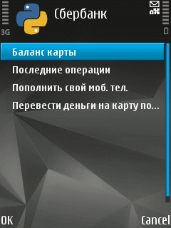

Минималистичный клиент Сбербанка для Symbian.

*( ! ) Для работы требуется подключённый к номеру SMS-банк (http://s.sber.ru/7wZSW).*

# Возможности
- Просмотр баланса карты
- Просмотр последних операций по карте (мини-выписка)
- Пополнение телефона
- Перевод на другую карту
- Не требует наличие интернета (достаточно сотовой сети для отправки SMS-запросов)

# Использование

- Установить Python for Symbian (PyS60)
- Сохранить файл sberbank.py в папку e:/data/python на телефоне
- Запустить оболочку Python
- Options -> Run script и выбрать файл sberbank.py
- Для некоторых действий (перевод на карту) потребуется отправить подтверждение через sms
