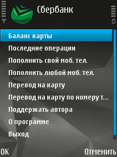
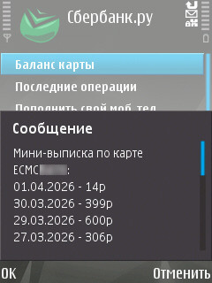
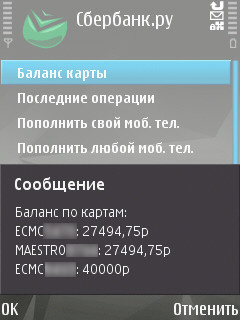
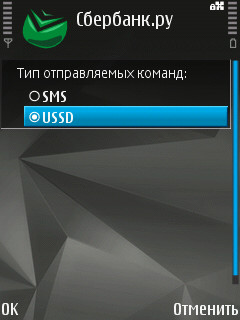

#  sberbank.py

Минималистичный клиент Сбербанка для Symbian (s60v3 - s60v5) на питоне.

   

*( ! ) Для работы требуется подключённый к номеру SMS-банк (http://s.sber.ru/7wZSW).*

# Возможности
- Просмотр баланса карты
- Просмотр последних операций по карте (мини-выписка)
- Пополнение телефона
- Перевод на другую карту
- Использование SMS/USSD-запросов
- Не требует наличие интернета (достаточно сотовой сети)

# Зависимости

- Symbian 9.1 - 9.5
- Python for S60 (PyS60) v2.0.0

# Установка
Установить на телефон два пакета:
1) [Python_2.0.0.sis](https://github.com/pymo/pymo/raw/refs/heads/master/symbian/PythonForS60/PyS60Dependencies/Python_2.0.0.sis)
2) [sberbank-py_vX_X_X.sis](https://github.com/artem78/SberbankPySymbian/releases/latest)

## Альтернативный вариант установки

1) Установить [Python_2.0.0.sis](https://github.com/pymo/pymo/raw/refs/heads/master/symbian/PythonForS60/PyS60Dependencies/Python_2.0.0.sis)
2) Из [архива](https://web.archive.org/web/20231208115724/https://garage.maemo.org/frs/download.php/7611/PyS60_binaries_certificate_error_fixed.zip) установить соответствующий PythonScriptShell_2.0.0_XXXX.sis
3) Сохранить файл sberbank.py в папку e:/data/python на телефоне (создать папку, если отсутствует)
4) Скопировать модуль kf_ussd.pyd из папки /ussd_module/bin-release/ussd/ в e:/sys/bin (todo: проверить) на телефоне
5) Запустить PythonScriptShell
6) Options -> Run script и выбрать файл e:sberbank.py

# Использование

Программа работает путём отправки SMS сообщений или USSD запросов (возможно выбрать в настройках) на короткий номер 900 ([sms-банк Сбербанка](https://www.sberbank.ru/common/img/uploaded/files/pdf/mob_ruk2.pdf])). Например, перевод на карту по номеру телефона 916 111 22 33 суммы в 2500 рублей производится отправкой следующего сообщения:

```
PEREVOD 9161112233 2500
```

Или USSD запросом:

```
*900*12*9161112233*2500#
```

Ответ (мини-выписка, баланс, уведомление об успехе платежа и т.п.) также приходит в виде sms и отображается в программе.

[Примеры смс запросов и ответов.](/sms_samples/samples.md)
