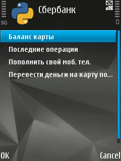

#  sberbank.py

Минималистичный СМС-клиент Сбербанка для Symbian на питоне.

*( ! ) Для работы требуется подключённый к номеру SMS-банк (http://s.sber.ru/7wZSW).*

# Возможности
- Просмотр баланса карты
- Просмотр последних операций по карте (мини-выписка)
- Пополнение телефона
- Перевод на другую карту
- Не требует наличие интернета (достаточно сотовой сети для отправки SMS-запросов)

# Установка и использование

1) Установить [Python for Symbian (PyS60)](https://sourceforge.net/projects/pys60/files/pys60/1.4.5/) -  PythonForS60_xxx.sis и PythonScriptShell_xxx.SIS ([инструкция](https://www.mobilenin.com/pys60/pys60_installation_resources.php))
2) Сохранить файл sberbank.py в папку e:/data/python на телефоне
3) Запустить PythonScriptShell
4) Options -> Run script и выбрать файл e:sberbank.py

*Для некоторых действий (например, перевод на карту) потребуется вручную отправить подтверждение через sms*
